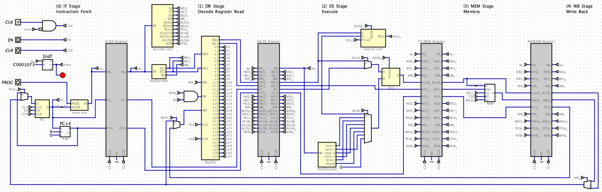

# Exam-like Problems

## You do not need to turn in your solutions to lab07

## Question 1 - Sum-of-Products

Consider implementing the Majority function of 3 1-bit inputs, `r = majority(a, b, c)`. The the value of the Majority function is true if and only if the majority (at least two) inputs are true. For example:

```text
majority(1, 0, 1) = 1
majority(0, 1, 0) = 0
```

Build a truth table for this function. Next, derive the sum-of-products boolean algebra equation for this function. Finally, draw a circuit that implements this function in terms of AND, OR, and NOT gates.

## Question 2 - Digital Design

Consider the following circuit called Max2, that determines the maximum of two 64-bit inputs. That is, the circuit take inputs A and B and the output is A if A > B, otherwise the output is B.


Build a new circuit called Max3 that determines the maximum value of 3 inputs: A, B, and C. You can use the library circuits use above (the comparator and multiplexor) and any additional gates you may need. Give a brief explanation in English how your new circuit works. Draw neatly. Note, you cannot implement Max3 in terms of Max2, you must use components and gates.


## Question 3 - Single Cycle Processor

Consider the following version of the RISC-V single-cycle processor you developed for Project06. For this problem you are going to answer some questions about the implementation then explain how to add some new instructions.


Answer the following questions below. Justify your answers. Answers without justification will receive 0.

- (1) What is the maximum number of instructions a single program can have in this processor?
- (2) How many registers can be updated in a single clock cycle?
- (3) Which instruction uses the second input to the ALUSrcA MUX?
- (4) What is the purpose of the SZ input to `mem-sd-sw-sb` and `mem-ld-lw-lb`? 

Now you are going to explain how to add new instructions to this processor. For each instruction, describe any additions or changes needed to the data path, the control path, and components. Also, explain changes needed in the instruction decoder. Completeness and details in your answer are important. You should assume that each of these instructions are currently not supported by this processor.

- (5) LWU (load word unsigned) This instruction loads a word (32 bits) from memory and puts the value into a 64 bit register. However, the word is not sign extended, like with LW (load word). Example usage: `lwu t0, (a0)`

- (6) SWPR (swap registers). This new instruction swaps two register values. Without this instruction, to swap register values, say `a0` and `a1`  you need to do the following:
```
mv t0, a0
mv a0, a1
mv a1, t0
```
With SWPR, you can just do `swpr a0, a1`


## Question 4 - Pipelined Processor

Consider the project07 starter pipelined processor below.



Answer the following questions and provide justification for answers. Answers without justification will receive 0.

Consider running the following code on the starter pipeline processor.
```
addi a1, zero, 3
addi a2, zero, 4
add a0, a1, a2
unimp
```

- (1) Explain why the code above produces the wrong result on the starter pipeline processor.

- (2) What result does this give? That is, what value will be in `a0` after executing this code?

- (3) Without modifying the processor implementation, how could you modify this code to make it run correctly?

Now consider running this code on a complete solution to project07. That is a version of this pipeline with a proper hazard unit that supports forwarding, stalling and flushing.

- (4) How many clock cycles will it take to complete the code given above?

- (5) When the code executes, are any flushes or stalls needed?

Now consider the following code on a complete solution to project07:
```
addi a1, zero, 3
sd a1, 0(zero)
ld a2, 0(zero)
add a0, a2, a2
unimp
```

- (6) How many clock cycles are needed to execute this program?

- (7) Is flushing needed when executing this code? If so, explain when it is needed.

- (8) Is stalling needed when executing this code? If so, explain when it is needed?

- (9) Is forwarding needed when excuting this code? If so, explain when it is needed.
